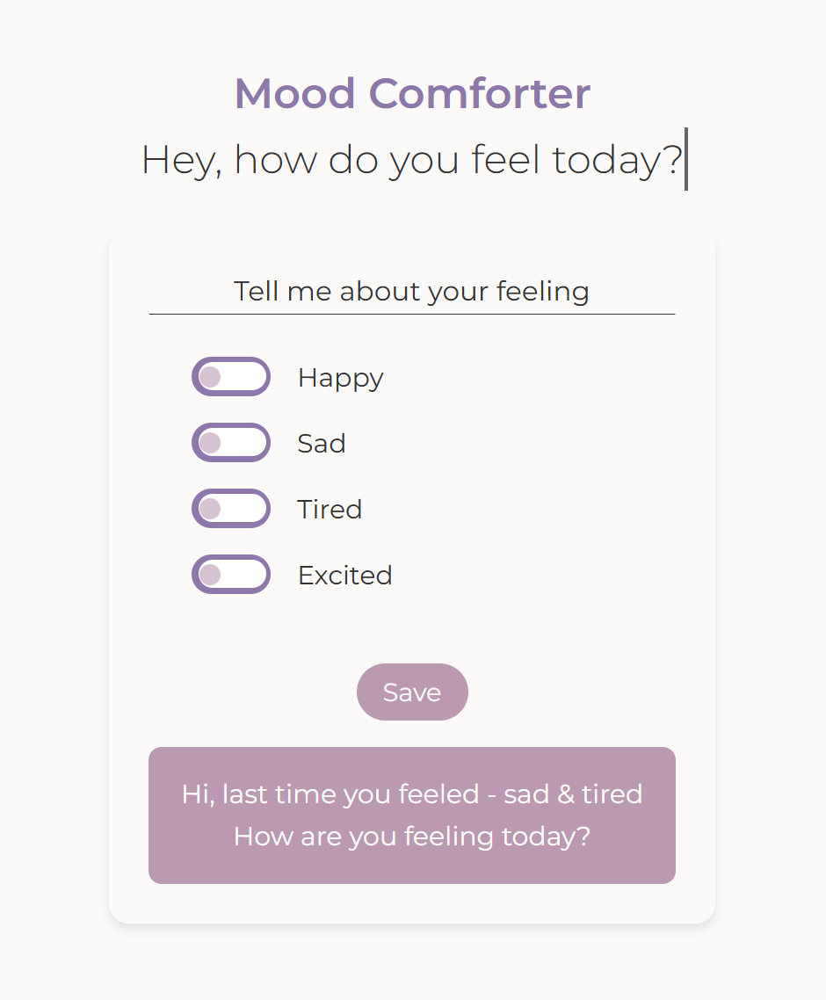

# ❤️‍🩹 Mood Comforter (React Version)

> An interactive mood tracker built with **React** that provides comforting messages based on selected emotions. This version enhances the original with React state management and component-based structure.

## Table of Contents

- [General Info](#general-info)
- [Screenshots](#screenshots)
- [Technologies](#technologies)
- [Setup](#setup)
- [Code Examples](#code-examples)
- [Features](#features)
- [To-Do List](#to-do-list)
- [Project Status](#project-status)
- [Inspiration](#inspiration)
- [Contact](#contact)

---

## General Info

Mood Comforter allows users to select their mood(s) and receive comforting messages. This React-based version uses **React hooks** for state management and implements **localStorage** to save mood selections.

---

## Screenshots



---

## Technologies

- React (v18+)
- JavaScript (ES6+)
- HTML5
- CSS3
- Node.js (v25)
- Visual Studio Code (IDE)

---

## Setup

1. Clone this repository:

   ```sh
   git clone https://github.com/boba-milktea/mood-comforter-react.git
   ```

2. Navigate to the project folder:

   ```sh
   cd mood-comforter-react
   ```

3. Install dependencies:

   ```sh
   npm install
   ```

4. Start the development server:

   ```sh
   npm run dev
   ```

5. Open the app in your browser at `http://localhost:${at your localhost}`.

---

## Code Examples

Example of handling mood selection and local storage update:

```js
const handleChange = (e) => {
  const { checked, id } = e.target;
  setMoods((prev) =>
    checked ? [...prev, id] : prev.filter((mood) => mood !== id)
  );
};
```

---

## Features

- ✅ Select multiple moods
- ✅ Get mood-based comforting messages
- ✅ Save and load moods using localStorage

---

## To-Do List

- [ ] Implement **Theme Context** to dynamically change the background based on the selected mood
- [ ] Improve accessibility (ARIA labels)
- [ ] Enhance UI/UX with animations

---

## Project Status

Project is: 🚧 In Progress

---

## Inspiration

Inspired by simple comfort message apps and the idea of using technology to bring emotional support.

---

## Contact

By [boba-milktea](https://github.com/boba-milktea)
